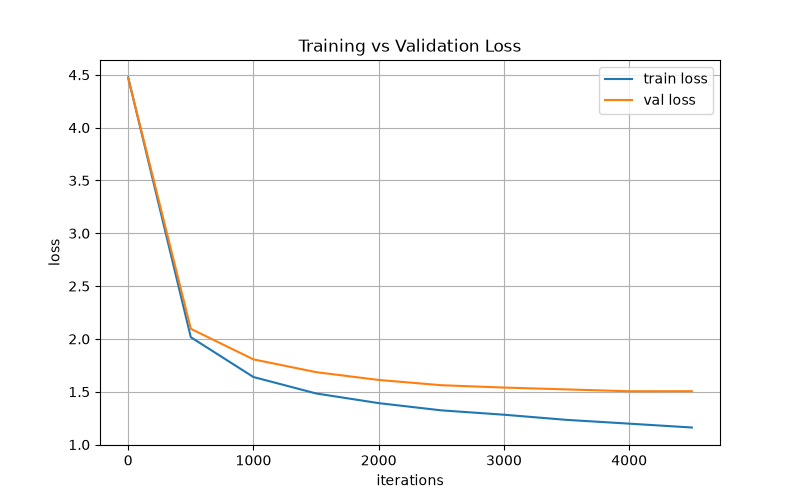

# NanoGPT-decoder-only-transformer

A GPT-style decoder-only transformer, implemented from scratch in PyTorch (no `nn.Transformer`) and trained to generate Shakespeare style text at the character level. Built while following Andrej Karpathy's ["Let's build GPT: from scratch, in code, spelled out"](https://www.youtube.com/watch?v=kCc8FmEb1nY) lecture.


## What this is

This implements the full architecture described in *Attention Is All You Need*, scaled down to run on a single GPU/CPU and trained on the [Tiny Shakespeare](https://raw.githubusercontent.com/karpathy/char-rnn/master/data/tinyshakespeare/input.txt) dataset (~1MB of text). It includes:

- Token + positional embeddings
- Multi-head causal self-attention, implemented head-by-head
- Feedforward blocks with residual connections and pre-layernorm
- A character-level tokenizer (no BPE — each unique character is its own token)
- Autoregressive sampling 

## Architecture

| Hyperparameter | Value |
|---|---|
| Embedding dimension | 384 |
| Attention heads | 6 (64-dim each) |
| Transformer blocks (layers) | 6 |
| Context length (block size) | 256 |
| Vocabulary size | 65 (characters) |
| Dropout | 0.2 |
| Parameters | ~10.7M |

## Results

Trained for 5000 steps with AdamW 

| Step | Train Loss | Val Loss |
|---|---|---|
| 3000 | 1.2829 | 1.5398 |
| 3500 | 1.2341 | 1.5225 |
| 4000 | 1.1983 | 1.5048 |
| 4500 | 1.1619 | 1.5055 |



Train loss keeps falling throughout training, but val loss flattens out and starts to creep up after ~step 3500 — the model is overfitting to the training text past that point. 

## Sample output

Generated text is:

```
Love:
Werthy is o' the mutily.

DUKE VINCENTIO:
Up, fellow, for at her, so gnow may I on the
not trade to my meet me; I had spent to the king:
If it rash be boar to stan him to know
here, man; at it offer, I; son; ere no serve he made,
make my meaning Leors can married quest hire.

DUKE OF YORK:
My master and Saint Paulia ling. First God of York
If this be mouch to my apper: if he he'll find
My score well offer'd himself and new in privilege
My compaint and dear of my degrees
and berry; and what I never proved meant;
And from myster treat manysire carlets,
The presents of favouratify from thence that haste,
Is by the virtue of that stale deserve for duke
And had shuntout a proclamation: by appear in with you
Ofter the duker: but his full presence forbiders,
Too true against themselves, his list-very vexeting
Mive weking your dishonours of called for lies;
Escare cared way as you doth sleeping to bearly.

FRIAR LAURENCE:
Ho! never, my lord, she's shower'd death.

FRIAR LAURENT:
For War
```

The model has clearly learned Shakespearean *structure* — character names in caps followed by a colon, line breaks, archaic diction and contractions ("o'", "stan'd") — without yet producing fully coherent sentences. That's expected for a character-level model at this scale; it's modeling spelling and rhythm well before it models meaning.

## Why character-level (and what I'd change at larger scale)

Character-level tokenization keeps the vocabulary tiny (65 tokens) and the implementation simple, but it means the model has to learn spelling, word boundaries, *and* grammar all from scratch, which is part of why generations look fluent at the letter level but wander semantically. A natural next step would be swapping in a subword tokenizer (BPE), which would let the same parameter budget spend more of its capacity on meaning instead of spelling.

## Project structure

```
.
├── input.txt          
├── GPT.py           
├── output.txt         
├── bigram.py        
├── requirements.txt        
└── loss_curve.png     
```

## Usage

**Install dependencies**
```bash
pip install torch matplotlib
```

**Train**
I also did bigram model but its prediction is horrible
```bash
python GPT.py
```
Trains for 5000 steps, printing train/val loss every 500 steps. Saves `best_model.pt`, `final_model.pt`, and `loss_history.json` when done.


## What I learned

- How self-attention works mechanically — query/key/value projections, scaled dot-product attention, and causal masking via a lower-triangular mask
- Why residual connections and pre-layernorm matter for training stability in deep transformer stacks
- The practical gap between train and val loss as a diagnostic for overfitting


## Acknowledgements

Built by following [Andrej Karpathy's nanoGPT lecture](https://www.youtube.com/watch?v=kCc8FmEb1nY). Architecture and training loop follow his teaching implementation closely; checkpointing, LR scheduling, loss logging, and configurable sampling were added on top.
